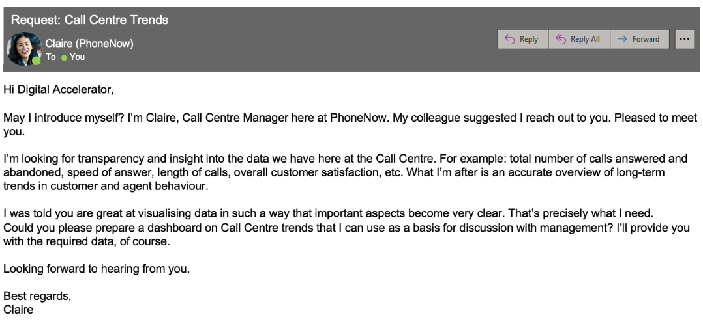
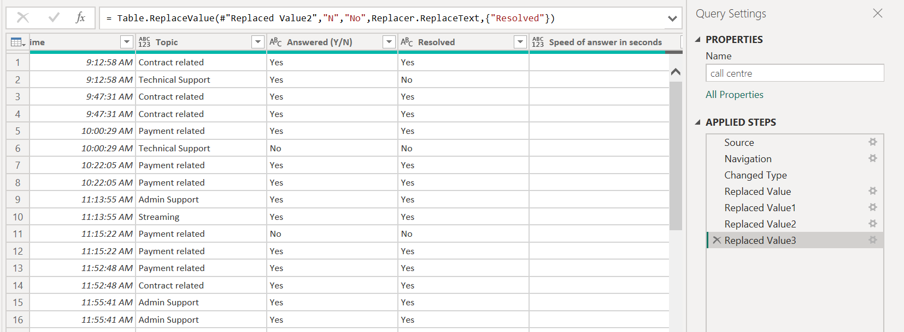
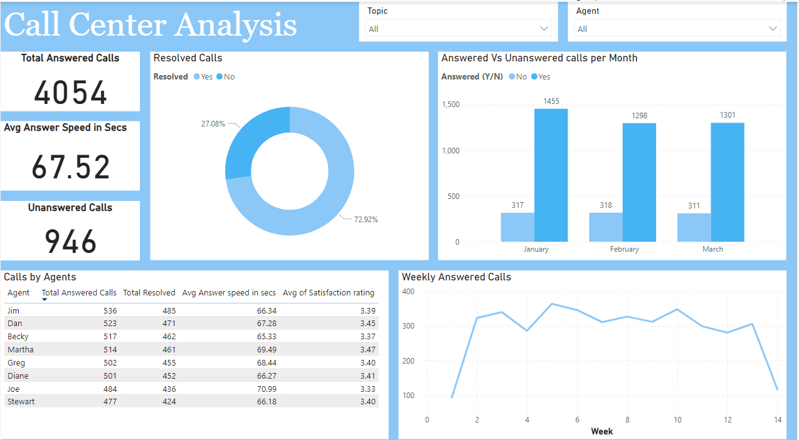
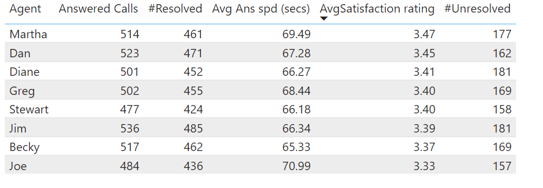
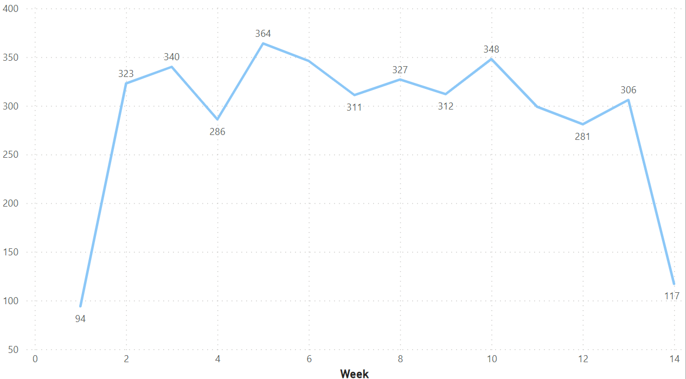

# PwC Virtual Internship Project: Call Center Performance Analysis

## Introduction

This project is part of my PwC virtual internship on Forage. The dataset, provided during the internship, offered a valuable opportunity to practice skills in Power BI visualization, analysis, and DAX. Guided by a problem statement from the internship, this report showcases how I applied these skills to transform data into actionable insights, reflecting PwC's commitment to digital transformation and innovative technology solutions.

## Problem Statement

## Skills Demonstrated

- **Calculating Measures**
- **Defining KPIs**
- **Insights and Actions**
- **Power BI**
- **Power BI Dashboard**
- **Self-Reflection**

## Data Sourcing

The dataset was provided during the internship. I downloaded the Excel file and imported it into Power BI for cleaning and visualization. This Call Center dataset has 11 columns and 5000 rows.

### Column Names

- **Call Id**: A unique identifier assigned to each call for tracking and reference purposes.
- **Agent**: The name or identification number of the customer service agent who handled the call.
- **Date**: The date when the call was made or received.
-  **Time**: The time when the call started.
- **Topic**: The subject or issue discussed during the call, such as technical support, billing inquiry, or general information.
- **Answered (Y/N)**: Indicates whether the call was answered by an agent (Y for Yes, N for No).
- **Resolved**: Indicates if the customer's issue was resolved during the call. This might be a simple Yes/No or more detailed statuses like "Pending," "Escalated," etc.
- **Speed of Answer in Seconds**: The amount of time (in seconds) it took for an agent to answer the call from the moment it was received.
- **AvgTalkDuration**: The average duration of the call, typically measured in seconds or minutes, from the start to the end of the conversation.
- **Satisfaction Rating**: The rating given by the customer regarding their satisfaction with the service received during the call. On a scale (e.g., 1-5).

## Data Transformation

The dataset was clean and didn’t need a lot of transformation. Here are a few changes made to the data:

1. Changed the data type of the "AvgTalkDuration" column to data type time.
2. Changed the values for the "Answered (Y/N)" column from "Y" to "Yes" and "N" to "No".
3. Changed the values for the "Resolved" column from "Y" to "Yes" and "N" to "No".

Below is a preview of the table.

## Modelling

This Call Center dataset only had one table, so no additional modelling was done.

---

# Call Center Performance Analysis and Visualization
## Call Center Dashboard

## Overview

The provided call center dashboard offers a comprehensive overview of various key performance metrics. This analysis addresses several critical aspects of call center performance, including total calls answered, total calls abandoned, speed of answer, and overall customer satisfaction. Additionally, it delves into individual agent performance and call trends over time.

### Key Metrics

- **Total Calls Answered**: 4054
- **Total Calls Abandoned**: 946
- **Average Speed of Answer**: 67.52 seconds
- **Overall Customer Satisfaction**: Evaluated per agent based on each call and issue resolved.

### Agent Performance

The performance of each agent is assessed based on the total calls answered, total issues resolved, average speed of answering calls, and the satisfaction rate provided by customers.

- **Jim**:
  - **Calls Answered**: 536
  - **Issues Resolved**: 485
- **Becky**:
  - **Average Speed of Answer**: 65.33 seconds
- **Joe**:
  - **Average Speed of Answer**: 70.99 seconds (longest)
  - **Satisfaction Rating**: 3.33 (lowest)
- **Martha**:
  - **Satisfaction Rating**: 3.47 (highest)

### Calls Answered by Time

- **Monthly Analysis**:
  - **January**: Highest number of answered calls
- **Weekly Analysis**:
  - **Week 5**: Highest number of answered calls (364)
  - **Week 1**: Least number of answered calls (94)

## Conclusions and Recommendations

### Conclusions

1. **High Volume of Calls**: The call center handled a substantial number of calls (4054), with a significant number being abandoned (946).
2. **Speed of Answer**: The average speed of answering calls was relatively slow at 67.52 seconds, with noticeable variations among agents.
3. **Customer Satisfaction**: Satisfaction ratings varied among agents, indicating differences in performance and customer interaction quality.

### Recommendations

1. **Reduce Call Abandonment**: Implement strategies to reduce the number of abandoned calls. This could involve optimizing call routing, improving IVR systems, or increasing staffing during peak times.
2. **Improve Speed of Answer**: Focus on reducing the average speed of answer, particularly for agents with slower response times. Consider additional training or process improvements.
3. **Enhance Customer Satisfaction**: Provide targeted training and support to agents with lower satisfaction ratings. Implement regular feedback sessions and use customer feedback to identify areas for improvement.
4. **Monitor Trends**: Continue monitoring call trends by month and week to allocate resources efficiently and address any fluctuations in call volume.

By addressing these areas, the call center can improve overall performance, reduce wait times, and enhance customer satisfaction.
---
